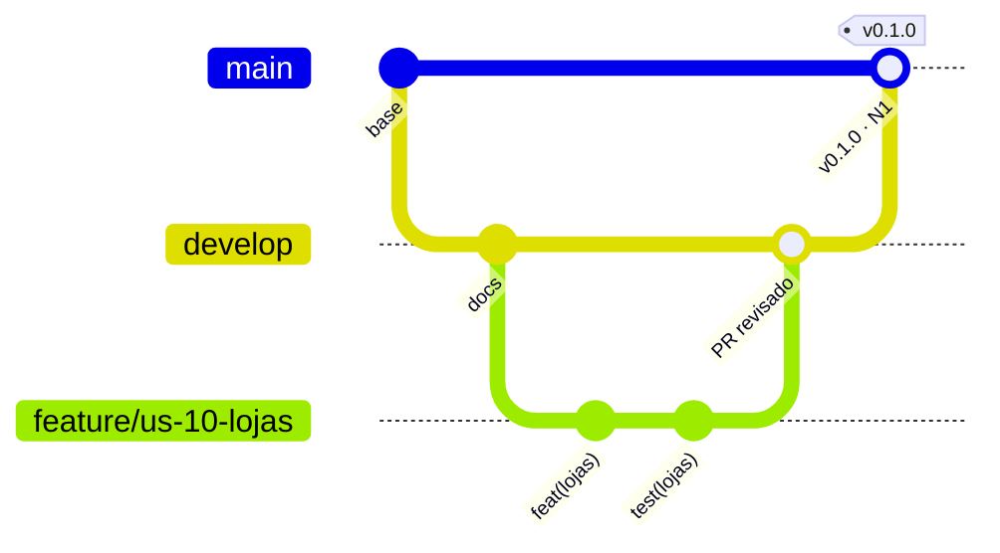

# Como contribuir

Convenções de trabalho da equipe. Valem para código e documentação, para quem escreve à mão e para
quem usa assistente de IA ([CLAUDE.md](CLAUDE.md)).

A base é o §6.2 do Norteador: ramo principal e ramos de funcionalidade, integração por PR revisado
por outro integrante, commits descritivos e nenhuma credencial versionada. O histórico também é a
prova da participação de cada um (FPI, §8.4), então **cada regra abaixo protege a sua nota**.

---

## Fluxo em uma tela



1. Atualize `develop` e crie a branch da tarefa a partir dela.
2. Commits pequenos, **todo dia de trabalho**, e `push` no mesmo dia.
3. PR para `develop`, CI verde, revisão cruzada, merge pelo revisor.
4. Nas entregas, `develop` vai para `main` por PR e recebe uma tag.

```bash
git switch develop && git pull --rebase
git switch -c feature/us-10-lojas
# ... trabalho e commits ...
git fetch origin && git rebase origin/develop   # antes de abrir o PR
git push -u origin HEAD
```

---

## Branches

| Branch | Uso | Quem escreve |
|---|---|---|
| `main` | Versão entregue. Cada merge é uma entrega com tag | Ninguém direto; só PR de `develop` |
| `develop` | Integração do ciclo; sempre compila e passa nos testes | Ninguém direto; só PR revisado |
| `feature/<id>-<resumo>` | Uma história ou item técnico | Dono da história |
| `fix/<resumo>` ou `fix/<issue>-<resumo>` | Correção de defeito | Quem corrige |
| `test/<resumo>` | Só testes automatizados | Alex, na maior parte |
| `docs/<resumo>` | Só documentação | Qualquer um |
| `chore/<resumo>` | Configuração, CI, dependências | Qualquer um |

- Nome em minúsculas, `kebab-case`, sem acento: `feature/us-10-lojas`, `feature/h-02-estrutura-api`, `fix/42-sync-duplicado`.
- **Uma branch, uma tarefa.** Vida curta: mais de 3 dias aberta é sinal de que a tarefa devia ter sido dividida.
- A branch é apagada depois do merge (automático no GitHub).
- Nunca `push --force` em branch que outra pessoa usa. Na sua própria branch, depois de um rebase,
  use `git push --force-with-lease`, à mão.

## Commits

Formato: `<tipo>(<escopo>): <descrição no imperativo>`, em português, até 72 caracteres, sem ponto
final. O CI recusa o PR com commit fora do padrão.

| Tipo | Quando |
|---|---|
| `feat` | Nova funcionalidade |
| `fix` | Correção |
| `test` | Testes |
| `docs` | Documentação |
| `refactor` | Mudança de estrutura sem mudar comportamento |
| `perf` | Desempenho |
| `style` | Formatação, sem mudar código |
| `chore` | Configuração, dependências, build, CI |
| `revert` | Desfaz um commit anterior |

| Escopo | Onde |
|---|---|
| `acesso` `compras` `lojas` `ofertas` `rastreio` `alertas` `referencia` `sync` `admin` | Módulo do domínio, nos dois lados ([arquitetura](docs/02-arquitetura/visao-geral.md)) |
| `api` `app` | Estrutura transversal de um lado (configuração, camadas, erro padrão) |
| `db` | Migrations e schema |
| `ci` `deps` | Pipeline e dependências |
| `docs` `readme` `adr` `testes` | Documentação, por área |

Exemplos: `feat(lojas): adiciona cadastro de loja no banco local` · `fix(sync): evita reenvio de compra já aceita` · `test(acesso): cobre bloqueio após cinco falhas` · `feat(db): cria tabela de compras`.

- **Um commit, uma mudança.** Código e o teste dele podem ir juntos; código e ajuste de docs sem relação, não.
- Descreva o que mudou, não o que você fez: "adiciona validação de data futura", nunca "ajustes", "update", "wip" ou "correções" (§6.2).
- Corpo opcional, depois de uma linha em branco, explica o **porquê**. Rodapé: `Refs: US-10`, `Closes #12`.
- Sem atribuição de IA e sem `Co-Authored-By` de ferramenta. O uso de IA é declarado em [declaracao-ia.md](docs/06-entregas/declaracao-ia.md).
- Nunca `--no-verify`, nunca commitar `.env`, build, `node_modules` ou `target`.
- Mudar o histórico só antes do push. Depois do push, corrige-se com commit novo.

## Pull requests

1. **Base `develop`.** Título no formato de commit; se o PR ganhar commits depois, o título é reescrito.
2. **Preencha o [template](.github/pull_request_template.md) inteiro**: história, regras e casos de teste, evidência e o que ficou de fora.
3. **Pequeno.** Até ~400 linhas alteradas, sem contar arquivo gerado. Maior que isso, divida.
4. **Revisão cruzada obrigatória**, pedida automaticamente pelo [CODEOWNERS](.github/CODEOWNERS):
   - PR da API (Higor) é revisado por Diogo; PR do app (Diogo) é revisado por Higor. Assim cada um conhece a outra ponta do contrato.
   - Alex confere em todo PR de código se os critérios de aceite e os casos de teste foram cobertos.
   - PR de testes ou documentação é revisado por Higor ou Diogo, conforme a parte afetada.
5. **Revisar é ler.** Aprovação sem comentário em PR grande não vale como revisão. Comente o porquê,
   sugira o como, e marque o que é bloqueante e o que é sugestão (`sugestão:`).
6. **Merge só com CI verde, conversas resolvidas e 1 aprovação.** Quem faz o merge é o revisor, com
   **Rebase and merge**, para manter cada commit e o autor dele no histórico de `develop`.
7. Depois do merge, atualize a coluna PR da [rastreabilidade](docs/05-qualidade/rastreabilidade.md) e mova o cartão no quadro.

**Por que rebase e não squash:** o squash junta todos os commits do PR em um só, com a data do
merge. O histórico ficaria concentrado, que é exatamente o que o §6.2 veda e o que o FPI penaliza.

## Issues e quadro

- Toda tarefa do ciclo existe como issue no [GitHub Projects](https://github.com/HigorPauulo/app-importaai/issues), criada pelos modelos **História** ou **Defeito**.
- Colunas: `Backlog` → `Ciclo` → `Em andamento` → `Em revisão` → `Pronto`. Só entra em `Pronto` o que cumpre a definição abaixo.
- Cada issue tem responsável, parte e ciclo. O PR fecha a issue com `Closes #n`.
- Defeito leva severidade (§6.3) e só é fechado corrigido ou com justificativa escrita na própria issue.

| Label | Uso |
|---|---|
| `historia` · `defeito` · `tecnico` | Tipo |
| `api` · `app` · `testes` · `docs` | Parte |
| `ciclo-1` a `ciclo-4` | Ciclo |
| `sev-critica` · `sev-alta` · `sev-media` · `sev-baixa` | Severidade do defeito |
| `bloqueado` | Depende de algo fora da equipe |
| `dependencias` | PR do Dependabot |

## Entregas e versões

Cada entrega é um merge de `develop` em `main` por PR, feito pelo responsável técnico com **Create a
merge commit**, seguido de uma tag anotada no commit de merge.

| Marco | Tag | Conteúdo |
|---|:---:|---|
| N1 (02/10) | `v0.1.0` | Especificação, protótipo, estrutura e acesso |
| Checkpoint 2 (06/11) | `v0.2.0` | Beta com persistência e API externa |
| Congelamento (27/11) | `v0.9.0` | Escopo fechado |
| N2 (07 a 11/12) | `v1.0.0` | Versão final, com o APK anexado ao Release |

```bash
git switch main && git pull --rebase
git tag -a v0.1.0 -m "N1: especificação, protótipo, estrutura do app e da API, acesso"
git push origin v0.1.0
gh release create v0.1.0 --title "v0.1.0 · N1" --notes-from-tag
```

- Tag só no commit que foi entregue, e nunca movida depois de publicada. Correção de uma entrega é `v0.1.1`.
- O endereço do repositório não muda depois da primeira entrega.

## Proteções no GitHub

Configuradas no repositório, para que as regras acima não dependam de memória:

| Onde | Proteção |
|---|---|
| `main` e `develop` | PR obrigatório, 1 aprovação, revisão do CODEOWNER, CI verde, conversas resolvidas, sem force push, sem exclusão |
| Repositório | Só **Rebase** e **Merge commit** habilitados (squash desligado); branch apagada após o merge |

---

## Definição de pronto

Uma história está pronta quando:

1. Os critérios de aceite foram verificados **no aparelho físico**.
2. A tela tem os quatro estados: carregando, vazio, erro e conteúdo.
3. Dado inválido é recusado com a mensagem junto ao campo.
4. O código está na camada certa ([arquitetura](docs/02-arquitetura/visao-geral.md)).
5. Os casos de teste correspondentes passaram e o CI está verde.
6. O PR foi revisado e aprovado por outro integrante.
7. Nenhuma credencial, chave ou endereço foi versionado.

## Código e documentação

| Item | Idioma |
|---|---|
| Código, nomes de arquivo, tabelas e colunas | inglês |
| Documentação, comentários, mensagens de commit, textos da interface | português do Brasil |

- Comentário explica o **porquê**, nunca o quê.
- Termos do domínio seguem o [glossário](docs/01-produto/glossario.md).
- SQL sempre parametrizado; segredos só em variáveis de ambiente, a partir de `.env.example`.
- Formatação segue o [.editorconfig](.editorconfig): UTF-8, LF, 2 espaços (4 em Java e SQL).

## Entregas acadêmicas

PDF nomeado como `PI2026-2_NomeDaEquipe_Etapa.pdf`, enviado pelo ambiente virtual até 23h59 da data limite. Atraso aceito com justificativa custa 20% por dia, por até 3 dias.
