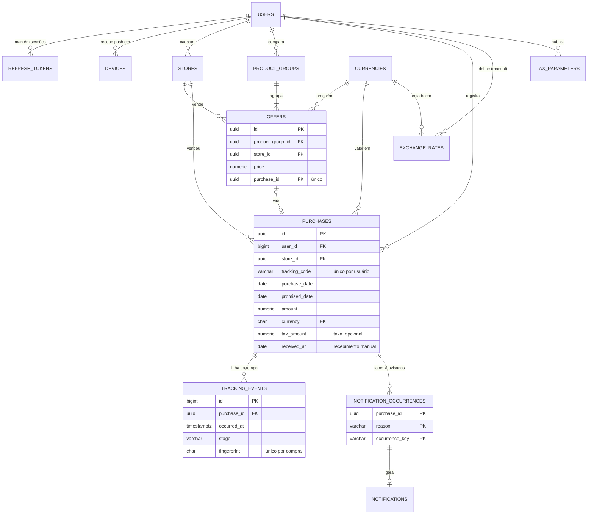

# Modelo de dados

As 14 tabelas do banco da API, as decisões que moldam o esquema, as garantias que o próprio banco impõe e o que o aparelho guarda localmente. As classes que estas tabelas persistem estão no [modelo de domínio](modelo-de-dominio.md).

---

## Fonte de verdade

| Artefato | Papel | Editado à mão? |
|---|---|:---:|
| [`sql/schema-postgres.sql`](sql/schema-postgres.sql) | Esquema físico da API. Vira a migration `V1__baseline.sql` do Flyway no H-02 | **sim** |
| [`sql/schema-checks.sql`](sql/schema-checks.sql) | 14 verificações das garantias do esquema, executadas contra um PostgreSQL 18 real | sim |
| [`sql/schema-sqlite.sql`](sql/schema-sqlite.sql) | Base local do aparelho. Vira a migration 1 do app | sim |
| [`schema.dbml`](schema.dbml) e [`der.svg`](der.svg) | DBML e diagrama físico | **não**: gerados |

Quando o SQL mudar, rodar:

```bash
docs/02-arquitetura/sql/generate-diagram.sh
```

O script sobe um PostgreSQL 18 descartável, aplica o esquema, extrai o DBML **do banco criado**, renderiza o diagrama e roda as verificações. Assim o diagrama nunca diverge do banco.

---

## Diagrama conceitual

As entidades e como se relacionam, sem colunas técnicas. O diagrama físico, com todas as colunas e chaves, é o [`der.svg`](der.svg).



`INTEGRATION_RUNS` não se relaciona com as demais: registra cada execução das rotinas de rastreio e de cotação para a tela de saúde da integração (T15).

---

## Decisões de modelagem

| Decisão | Motivo |
|---|---|
| **Dados derivados não são gravados:** situação, sinalizações, valor em reais e custo simulado | Cada um depende de dados que mudam (eventos, cotação, parâmetros, a própria data). Gravar criaria uma segunda verdade que diverge em silêncio |
| **Registros criados no aparelho usam UUID v7**, conferido por `check (uuid_extract_version(id) = 7)` | A compra feita sem rede precisa de identidade antes de chegar ao servidor; o v7 mantém a ordem de criação e a inserção eficiente no índice. O `check` impede que um cliente com defeito mande v4 |
| **Referências do acervo por chave composta `(user_id, id)`** | O uuid vem do aparelho, portanto pode vir adulterado. Com a FK composta, o banco recusa uma compra que aponte para a loja de outro usuário: a RN08 vale também no banco, não só na API |
| **Instantes em `timestamptz`; datas de negócio em `date`** | `timestamp` sem fuso guarda a hora local do servidor e erra na troca de fuso. Prazos, vencimentos e datas de compra são datas civis, sem hora |
| **Dinheiro em `numeric(12,2)`; cotação em `numeric(18,6)`** | Ponto flutuante erra centavos. Seis casas acomodam moedas de valor unitário baixo |
| **Exclusão por marca (`deleted_at`)** no acervo sincronizado | Sem a marca, a exclusão feita num aparelho não chegaria aos outros. Marcas com mais de 30 dias são removidas; o protocolo de [sincronização](sincronizacao.md) trata aparelhos parados há mais tempo |
| **`row_version`, `change_xid` e `last_mutation_id`** nas tabelas sincronizadas | Trava otimista contra edição simultânea em dois aparelhos, cursor de sincronização que não depende de relógio e envio idempotente ([ADR-008](decisoes/adr-008-protocolo-de-sincronizacao.md)). Mantidos por gatilho, para nenhum DAO esquecer |
| **Grupo de produto é entidade** (`product_groups`) | O nome do produto sendo comparado pertence ao grupo, não a cada oferta. Com o nome repetido nas ofertas, renomear o grupo exigiria atualizar N linhas e elas poderiam divergir (violação da 3FN) |
| **Livro de ocorrências de alerta** (`notification_occurrences`) separado das notificações | A RN11 apaga notificações lidas; se a deduplicação dependesse delas, o alerta apagado voltaria na avaliação seguinte ([ADR-010](decisoes/adr-010-ocorrencia-de-alerta.md)) |
| **Caixa de saída do push** (`notifications.push_status`) | O alerta é gravado na transação da regra; o push é enviado depois, por uma rotina que tenta de novo. Chamar a Expo dentro da transação prenderia conexões do banco a uma rede externa |
| **Parâmetros fiscais só recebem inserção**, garantido por gatilho | Editar a versão em uso mudaria em silêncio simulações já vistas; cada mudança é uma nova versão com data de vigência |
| **Cotação e parâmetros sem FK a partir da compra** | A cotação pode faltar na data exata ou chegar depois; uma FK transformaria esse caso previsto em erro e faria o cadastro depender de rede |
| **Moedas em tabela de referência** (`currencies`) | O banco recusa moeda não suportada, e o app recebe a lista pela sincronização em vez de tê-la fixa no código |
| **Tokens de renovação no banco**, só o hash | Sem registro no servidor, sair da conta e bloquear pelo administrador não teriam efeito até o token expirar ([ADR-009](decisoes/adr-009-sessao-e-revogacao.md)) |
| **Enumerações como `varchar` + `check`** | Legíveis no SQL da arguição; acrescentar um valor é trocar um `check`, sem `ALTER TYPE` |

---

## Tabelas

Toda tabela tem `created_at`; as que mudam têm `updated_at`. As tabelas sincronizadas (`stores`, `product_groups`, `offers`, `purchases`) têm ainda `row_version`, `change_xid`, `last_mutation_id` e `deleted_at`. Não se repetem abaixo. Tipos, `check` e padrões completos estão no [SQL](sql/schema-postgres.sql).

### Pessoas, sessões e aparelhos

**`users`** · contas de comprador e administrador

| Coluna | Tipo | Regra |
|---|---|---|
| id | bigint identity | PK |
| name | varchar(120) | obrigatório, não vazio |
| email | varchar(180) | único; gravado em minúsculas (`check`) |
| password_hash | varchar(255) | BCrypt |
| role | varchar(8) | `BUYER` ou `ADMIN` |
| is_blocked · blocked_by · blocked_at | boolean · bigint · timestamptz | bloqueio pelo administrador; `is_blocked` exige `blocked_at` |
| failed_login_attempts · locked_until | smallint · timestamptz | bloqueio automático de 15 min |
| last_login_at | timestamptz | exibido em T13 |

**`refresh_tokens`** · sessões ativas: `family_id` (a cadeia de rotação), `token_hash` (SHA-256, único), `expires_at`, `revoked_at`, `replaced_by`.

**`devices`** · aparelhos que recebem push: `push_token` único (se o aparelho troca de conta, o registro passa ao novo dono), `platform`, `last_seen_at`. A linha é removida na saída da conta naquele aparelho e todas as da conta, no bloqueio; o push só vai para quem tem sessão.

### Acervo do comprador

**`stores`** · lojas: `name` único por usuário entre as não excluídas, sem distinguir maiúsculas; `country_code` (ISO 3166-1); `website`.

**`product_groups`** · o produto que está sendo comparado: `name`.

**`offers`** · ofertas antes da compra

| Coluna | Tipo | Regra |
|---|---|---|
| id | uuid v7 | PK, gerado no aparelho |
| product_group_id | uuid | FK composta para o grupo do mesmo usuário |
| store_id | uuid | FK composta para a loja do mesmo usuário |
| price · shipping_amount | numeric(12,2) | preço > 0; frete ≥ 0 |
| currency | char(3) | FK `currencies` |
| product_url | varchar(500) | opcional, `http(s)://` |
| purchase_id | uuid | FK composta; única; na exclusão da compra, só esta coluna vira nula |

**`purchases`** · compras

| Coluna | Tipo | Regra |
|---|---|---|
| id | uuid v7 | PK, gerado no aparelho |
| store_id | uuid | FK composta; loja em uso não pode ser apagada |
| product_description | varchar(180) | obrigatório |
| tracking_code | varchar(40) | `^[A-Z0-9]{8,40}$`; único por usuário entre as não excluídas |
| purchase_date · promised_date | date | prazo ≥ data da compra; data não futura é regra da API |
| amount · shipping_amount | numeric(12,2) | valor > 0; frete ≥ 0 |
| currency | char(3) | FK `currencies` |
| tax_amount · tax_due_date · tax_paid_at | numeric · date · timestamptz | vencimento e pagamento exigem valor |
| received_at | date | recebimento confirmado pelo usuário; torna a compra entregue ([domínio](modelo-de-dominio.md#situação-da-compra-rn01)) |
| notes | text | até 2000 caracteres; editável mesmo após concluída |
| archived_at | timestamptz | arquivamento |
| tracking_checked_at | timestamptz | última consulta à fonte de rastreio |

### Rastreio e alertas

**`tracking_events`** · eventos da transportadora: `occurred_at`, `description`, `location`, `stage` (etapa classificada na importação) e `fingerprint`, único por compra.

A fonte devolve o histórico inteiro a cada consulta, sem identificador por evento. O `fingerprint` (SHA-256 do instante em UTC e da descrição normalizada) é o que impede duplicar (RF-13), inclusive com duas importações simultâneas.

| `stage` | Etapa |
|---|---|
| `POSTED` · `ORIGIN_DEPARTURE` · `INTERNATIONAL_TRANSIT` | Postado · Saída da origem · Trânsito internacional |
| `ARRIVED_BRAZIL` · `CUSTOMS` · `AWAITING_PAYMENT` | Chegada ao Brasil · Fiscalização · Aguardando pagamento |
| `DOMESTIC_TRANSIT` · `OUT_FOR_DELIVERY` | Em distribuição · Saiu para entrega |
| `DELIVERED` · `RETURNED` · `OTHER` | Entregue · Devolvido · Outro (ignorado pela RN01) |

**`notification_occurrences`** · fatos que já geraram alerta. Chave primária `(purchase_id, reason, occurrence_key)`. Nunca apagada pela retenção; só some com a compra.

**`notifications`** · alertas exibidos

| Coluna | Tipo | Regra |
|---|---|---|
| id | bigint identity | PK |
| user_id · purchase_id | bigint · uuid | FK composta para a compra do mesmo usuário |
| reason · occurrence_key | varchar | FK para a ocorrência; única (um alerta por ocorrência) |
| message | varchar(255) | texto exibido |
| read_at | timestamptz | leitura |
| push_status · push_attempts | varchar · smallint | caixa de saída: `PENDING`, `SENT`, `FAILED`, `SKIPPED` |

A RN06 é garantida em uma instrução, segura com execuções simultâneas:

```sql
insert into notification_occurrences (purchase_id, reason, occurrence_key)
values (?, ?, ?)
on conflict do nothing;   -- 0 linhas: fato já avisado, nada a fazer
```

Só quando a linha é inserida a notificação é criada, na mesma transação.

### Referência

**`currencies`** · moedas suportadas (USD, CNY, EUR) e casas decimais.

**`exchange_rates`** · cotação em reais por moeda e data, com origem `API` ou `MANUAL`. Única por moeda, data e origem: a manual prevalece na leitura sem apagar a automática. Manual exige autor (`check`).

**`tax_parameters`** · versões dos parâmetros fiscais: vigência (única), limite em dólar, alíquotas até e acima do limite, dedução, ICMS (entre 0 e 1) e autor. A vigente numa data é a de maior `valid_from` até ela. Só inserção.

### Operação

**`integration_runs`** · cada execução das rotinas de rastreio e cotação: integração, fonte usada, situação (`RUNNING`, `SUCCESS`, `PARTIAL`, `FAILED`), itens consultados e importados, falhas e resumo do erro. Execução encerrada exige `finished_at`. Uma `RUNNING` com mais de duas vezes o intervalo da rotina é órfã e é encerrada como `FAILED` antes da próxima abertura ([domínio](modelo-de-dominio.md#execução-de-integração)).

---

## Índices

Cada índice existe por uma consulta ou garantia concreta.

| Índice | Tipo | Para quê |
|---|---|---|
| `users(email)` | único | Login |
| `refresh_tokens(token_hash)` | único | Validar a renovação |
| `refresh_tokens(family_id)` | | Revogar a família inteira no reuso |
| `refresh_tokens(user_id) where revoked_at is null` | parcial | Revogar tudo ao bloquear ou excluir a conta |
| `devices(push_token)` | único | Um token, um dono |
| `stores(user_id, lower(name)) where deleted_at is null` | único parcial | Loja duplicada, ignorando maiúsculas |
| `purchases(user_id, tracking_code) where deleted_at is null` | único parcial | RF-08 |
| `(user_id, id)` em stores, product_groups, purchases | único | Alvo das FKs compostas |
| `(user_id, change_xid)` nas 4 tabelas sincronizadas | | `GET /sync/pull`: o que mudou desde o cursor |
| `tracking_events(purchase_id, fingerprint)` | único | Deduplicação |
| `tracking_events(purchase_id, occurred_at desc)` | | Linha do tempo e RN01, a consulta mais frequente |
| `purchases(promised_date) where deleted_at is null and received_at is null` | parcial | Rotina diária de atraso e janela, só compras em andamento |
| `purchases(tracking_checked_at nulls first) where …` | parcial | Escolher as compras há mais tempo sem consulta |
| `notifications(purchase_id, reason, occurrence_key)` | único | Um alerta por ocorrência |
| `notifications(user_id, created_at desc)` | | Aba Alertas |
| `notifications(user_id) where read_at is null` | parcial | Contador de não lidos |
| `notifications(created_at) where push_status = 'PENDING'` | parcial | Caixa de saída do push |
| `exchange_rates(currency, rate_date, source)` | único | RN07 |
| `integration_runs(integration) where status = 'RUNNING'` | único parcial | Impede duas execuções simultâneas da mesma rotina |
| `integration_runs(integration, started_at desc)` | | T15 |

---

## Garantias verificadas

Cada linha é um bloco de [`schema-checks.sql`](sql/schema-checks.sql), executado contra PostgreSQL 18 em 28/09/2026 com resultado **14 de 14**.

| # | Garantia | Regra |
|:---:|---|:---:|
| 1 | Compra não aponta para loja de outro usuário | RN08 |
| 2 | Identificador do aparelho precisa ser UUID v7 | ADR-003 |
| 3 | Código de rastreio único por usuário | RF-08 |
| 4 | Toda alteração avança `row_version` e `change_xid` | ADR-008 |
| 5 | Atualização com versão antiga não sobrescreve | ADR-008 |
| 6 | Mesma ocorrência não gera alerta de novo, mesmo após a retenção apagá-lo | RN06, RN11 |
| 7 | Evento de rastreio repetido é recusado | RF-13 |
| 8 | Parâmetro fiscal não aceita edição | RN10 |
| 9 | Cotação manual exige autor | RF-22 |
| 10 | Duas execuções simultâneas da mesma integração são recusadas | RF-23 |
| 11 | Excluir a conta apaga todo o acervo numa cascata | RF-03 |
| 12 | Loja em uso não pode ser apagada | RF-12 |
| 13 | Alteração em transação aberta não escapa do cursor de sincronização | ADR-008 |
| 14 | Consulta à fonte de rastreio não avança a versão da compra (sem conflito falso) | ADR-008 |

---

## Normalização

O esquema está na **terceira forma normal** (e na forma normal de Boyce-Codd):

- **1FN:** atributos atômicos; a linha do tempo e as ocorrências de alerta estão em tabelas próprias, não em listas dentro da compra.
- **2FN:** as tabelas com chave composta (`notification_occurrences`) têm apenas `created_at` como atributo, que depende da chave inteira.
- **3FN:** nenhum atributo depende de outro não chave. Os candidatos a violar (situação, valor em reais, custo simulado) não são gravados, e o nome do produto saiu das ofertas para o grupo.

**Redundância controlada, e por quê:** `notifications.user_id` repete o dono da compra. Fica para permitir a FK composta (a notificação nunca aponta para compra de outro usuário) e o índice da aba Alertas sem junção. A FK garante que a cópia não diverge.

---

## Retenção

| Dado | Regra | Rotina |
|---|---|---|
| Marcas de exclusão do acervo | Removidas 30 dias depois; compras e ofertas antes das lojas e grupos | Limpeza diária |
| Notificações lidas | Mantidas as 50 mais recentes por usuário (RN11); não lidas nunca são apagadas | Limpeza diária |
| Ocorrências de alerta | Mantidas enquanto a compra existir | Cascata |
| Tokens de renovação | Expirados ou revogados há mais de 7 dias | Limpeza diária |
| Execuções de integração | 90 dias | Limpeza diária |
| Conta excluída | Tudo o que é do usuário, na mesma transação (cascata) | RF-03 |

Contas de administrador que publicaram cotação ou parâmetros não são excluídas, só bloqueadas: o autor faz parte do histórico fiscal (FK sem cascata).

---

## Base local do aparelho

Esquema completo em [`sql/schema-sqlite.sql`](sql/schema-sqlite.sql). Uma base por conta, apagada ao encerrar a sessão.

| Tabela local | Escrita no aparelho | Para quê |
|---|:---:|---|
| stores, product_groups, offers, purchases | sim | Cadastrar, editar e excluir sem rede |
| tracking_events | não | Linha do tempo |
| purchase_states | não | Situação e sinalizações calculadas pela API, para exibir sem rede. Cache reescrito a cada pull |
| notifications | só a leitura | Marcar como lido sem rede |
| exchange_rates, tax_parameters, currencies | não | Simular e converter sem rede |
| sync_state | sim | Dono da base, cursor e hora da última sincronização |

| Diferença em relação ao servidor | Motivo |
|---|---|
| Dinheiro em `INTEGER` na menor unidade (centavos) | SQLite não tem decimal; float erra centavos |
| Sem `user_id` | Uma base por conta |
| `sync_state` (`SYNCED`, `PENDING`, `REJECTED`), `mutation_id` e `row_version` em cada registro editável | Fila de envio embutida na própria linha: várias edições offline viram um único envio |
| FKs simples | Um único dono; o isolamento é garantido no servidor |

---

## Mudanças em relação à versão de 28/09

| Mudança | Por quê |
|---|---|
| `timestamp` → `timestamptz` em todos os instantes | Fuso errado na leitura e na troca de horário |
| FKs compostas `(user_id, id)` no acervo | RN08 garantida no banco contra uuid adulterado |
| + `product_groups`; oferta perde `product_description` | 3FN; o nome é do grupo |
| + `purchases.received_at` | Compra sem evento de entrega ficaria atrasada para sempre |
| + `notification_occurrences`; `milestone` → `occurrence_key`; índice parcial de não lidos → único por ocorrência | O índice antigo deixava o mesmo alerta voltar a cada 20 minutos depois de lido |
| + `notifications.push_status` e `push_attempts` | Caixa de saída; push fora da transação |
| + `refresh_tokens` | Sair e bloquear precisam ter efeito imediato |
| + `users.blocked_at`; `blocked_until` → `locked_until` | T13 mostra a data do bloqueio; bloqueio automático e pelo administrador eram confundidos |
| + `currencies` | Moeda válida garantida no banco |
| + `row_version`, `change_xid`, `last_mutation_id` | Protocolo de sincronização ([ADR-008](decisoes/adr-008-protocolo-de-sincronizacao.md)) |
| `sync_runs` → `integration_runs`, com `integration` e `source` | "Sincronização" é a troca aparelho-servidor; a rotina de rastreio é integração. Passa a registrar também a cotação |
| `purchases.last_synced_at` → `tracking_checked_at` | Mesmo motivo |
| Garantias em `check`, gatilho e verificação automatizada | Regra escrita só no documento não é regra |
