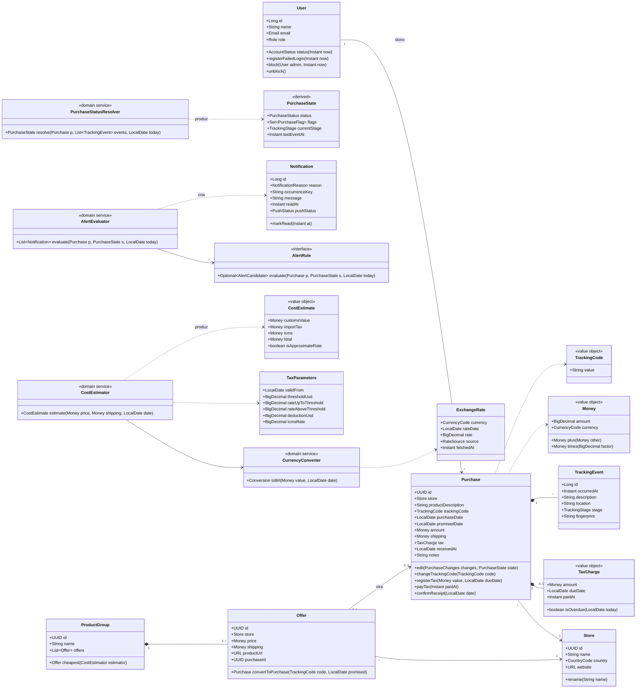
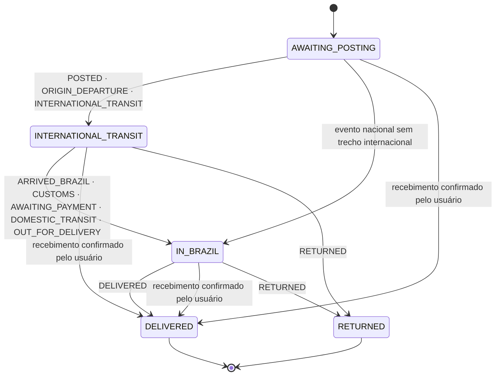
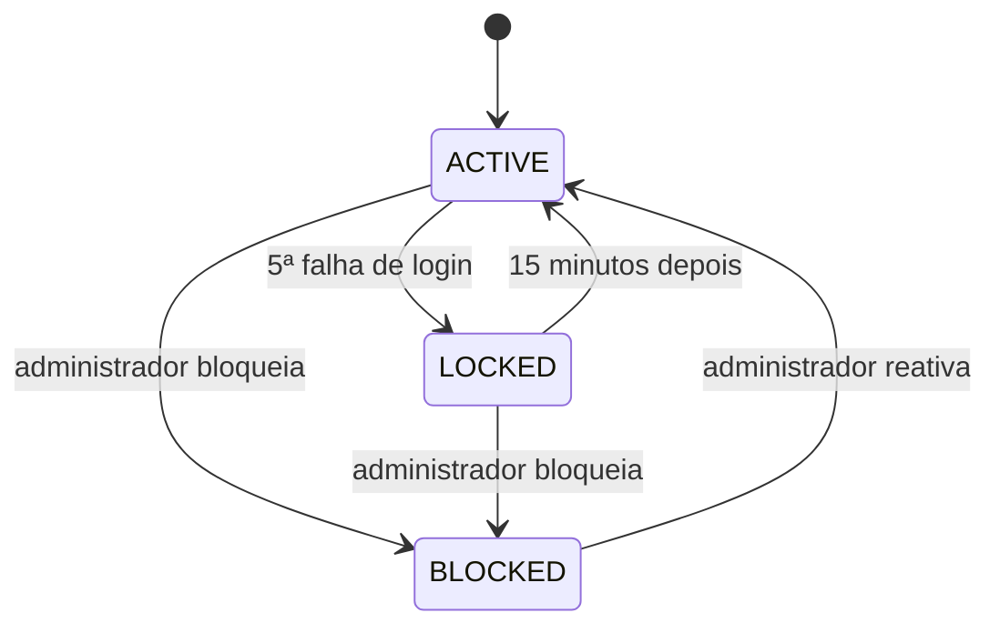
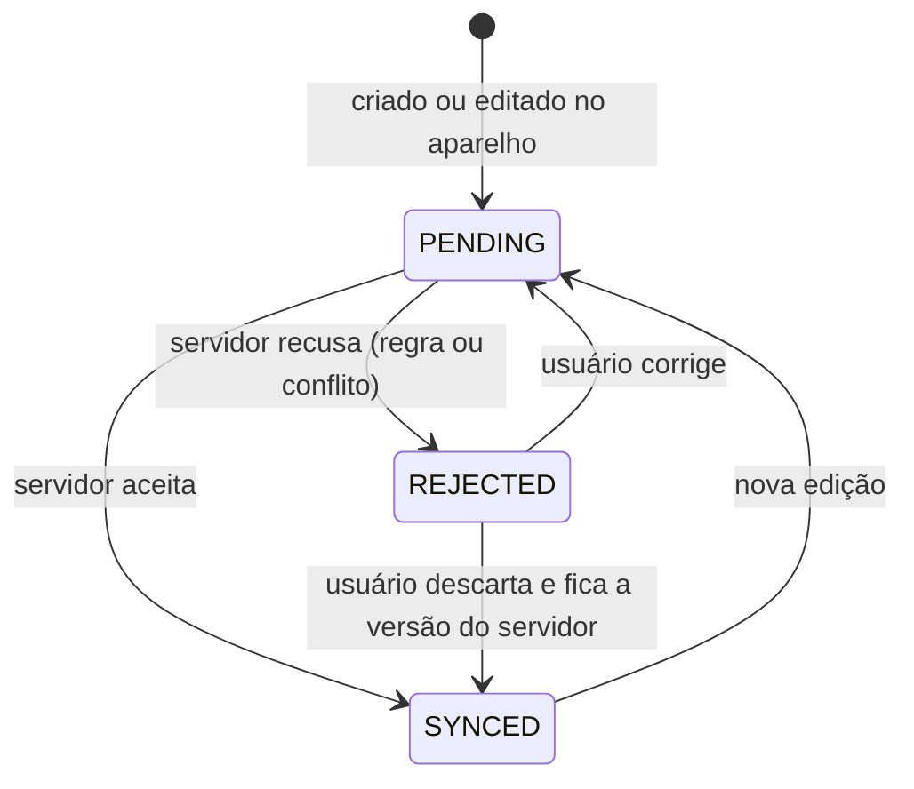

# Modelo de domínio

As classes, os objetos de valor, as regras e os estados do Importa Aí, independentes de framework, banco ou tela. É a camada **Domínio** do app e a camada **Serviços** da API ([arquitetura](visao-geral.md)): o que se testa sem aparelho, rede nem banco (RNF-08).

O modelo relacional que persiste estas classes está em [modelo de dados](modelo-de-dados.md); a troca entre aparelho e servidor, em [sincronização](sincronizacao.md).

---

## Módulos e agregados

Um **agregado** é um grupo de objetos que muda junto e tem uma raiz responsável por suas regras. Nada fora do agregado altera suas partes diretamente.

| Módulo | Agregado (raiz) | Partes | Dono das regras |
|---|---|---|---|
| `acesso` | **User** | sessões (RefreshToken), aparelhos (Device) | API |
| `compras` | **Store** | · | App e API |
| `ofertas` | **ProductGroup** | ofertas (Offer) | App |
| `compras` | **Purchase** | taxa (TaxCharge), linha do tempo (TrackingEvent) | API |
| `alertas` | **Notification** | ocorrência (NotificationOccurrence) | API |
| `referencia` | **ExchangeRate** · **TaxParameters** | · | API publica; app consome |
| `rastreio` | **IntegrationRun** | · | API |

**Por que Offer fica dentro de ProductGroup:** a comparação (RF-06) e a indicação da menor oferta só fazem sentido no grupo; uma oferta solta não tem com o que ser comparada.

**Por que TrackingEvent fica dentro de Purchase:** eventos não existem sem a compra, são substituídos juntos quando o código de rastreio muda e são a única entrada da RN01.

---

## Diagrama de classes



Tipos em notação Java, a da API. No app os nomes são os mesmos, em TypeScript; `BigDecimal` vira aritmética decimal e dinheiro é guardado em centavos (`Money.amountMinor`).

---

## Objetos de valor

Imutáveis, comparados pelo conteúdo e **válidos por construção**: um `TrackingCode` inválido não chega a existir, então nenhum método precisa revalidá-lo.

| Objeto | Invariante | Onde a violação aparece |
|---|---|---|
| `Money` | Valor com 2 casas; operações só entre a mesma moeda | Exceção de programação (erro de código, não de usuário) |
| `TrackingCode` | Maiúsculas, sem espaços, `^[A-Z0-9]{8,40}$` | `VALIDATION_ERROR` no campo `trackingCode` |
| `Email` | Minúsculas, com `@` e domínio | `VALIDATION_ERROR` no campo `email` |
| `TaxCharge` | Valor > 0; vencimento e pagamento exigem valor | `VALIDATION_ERROR` no campo da taxa |
| `CostEstimate` | `total = customsValue + importTax + icms`, parcela por parcela | Garantido pela construção |

**Arredondamento (RN10):** cada parcela é arredondada para centavos (meio para cima) **antes** de somar. O total exibido é sempre a soma das parcelas exibidas; o usuário nunca vê R$ 0,01 de diferença entre as linhas e o total.

---

## Enumerações

| Enum | Valores |
|---|---|
| `Role` | `BUYER`, `ADMIN` |
| `AccountStatus` | `ACTIVE`, `LOCKED` (bloqueio automático, temporário), `BLOCKED` (pelo administrador) |
| `TrackingStage` | `POSTED`, `ORIGIN_DEPARTURE`, `INTERNATIONAL_TRANSIT`, `ARRIVED_BRAZIL`, `CUSTOMS`, `AWAITING_PAYMENT`, `DOMESTIC_TRANSIT`, `OUT_FOR_DELIVERY`, `DELIVERED`, `RETURNED`, `OTHER` |
| `PurchaseStatus` | `AWAITING_POSTING`, `INTERNATIONAL_TRANSIT`, `IN_BRAZIL`, `DELIVERED`, `RETURNED` |
| `PurchaseFlag` | `TAX_TO_REGISTER`, `TAX_PENDING`, `TAX_OVERDUE`, `DELAYED`, `STALLED`, `CLAIM_WINDOW_CLOSING`, `CLAIM_WINDOW_CLOSED` |
| `NotificationReason` | `TAX_DETECTED`, `TAX_DUE`, `TAX_OVERDUE`, `DELAYED`, `STALLED`, `CLAIM_WINDOW` |
| `PushStatus` | `PENDING`, `SENT`, `FAILED`, `SKIPPED` |
| `RateSource` | `API`, `MANUAL` |

---

## Serviços de domínio

Regras que envolvem mais de um objeto ficam em serviços sem estado. Todos recebem a data corrente (`today`) ou um `Clock` como parâmetro: nenhum lê o relógio do sistema, então os testes fixam "hoje" em 12/10/2026 sem truque.

| Serviço | Regras | Lado | Entrada → saída |
|---|---|:---:|---|
| `CurrencyConverter` | RN07 | App | valor + data → valor em reais, com aviso de cotação aproximada ou desatualizada |
| `CostEstimator` | RN10 | App | preço + frete + data → `CostEstimate` com as três parcelas |
| `PurchaseStatusResolver` | RN01, RN02, RN03, RN04, RN05 | API | compra + eventos + hoje → `PurchaseState` |
| `AlertEvaluator` | RN06 | API | compra + estado + hoje → alertas novos, um por ocorrência |
| `TrackingImporter` | RF-13 | API | eventos da fonte → eventos novos (deduplicados pelo `fingerprint`) |
| `TaxReminderScheduler` | RN04 (lembretes) | App | taxa registrada → três lembretes locais agendados |

### Regras de alerta (padrão Strategy)

Cada motivo de alerta é uma implementação de `AlertRule`. O `AlertEvaluator` roda todas e registra só as ocorrências novas. Acrescentar um motivo é acrescentar uma classe, sem tocar nas outras.

| Implementação | Dispara quando | Chave de ocorrência |
|---|---|---|
| `TaxDetectedRule` | Último evento é `AWAITING_PAYMENT` e não há taxa registrada | `E<id do evento>` |
| `TaxDueRule` | Faltam 5, 2 ou 0 dias para o vencimento, taxa não paga | `D-5:<vencimento>` · `D-2:…` · `D-0:…` |
| `TaxOverdueRule` | Vencimento passou sem pagamento | `<vencimento>` |
| `DelayedRule` | Hoje > prazo prometido e situação não final | `<prazo prometido>` |
| `StalledRule` | Em trânsito e 15 dias ou mais sem evento | `E<id do último evento>` |
| `ClaimWindowRule` | Faltam 3 dias ou menos para prazo + 30, sem entrega | `<data de fechamento>` |

A chave identifica **o fato**, não o momento da avaliação. Por isso a mesma condição reavaliada a cada 20 minutos cai na mesma chave e não gera outro alerta, e um fato novo (outro prazo, outro vencimento, outro evento) gera uma chave nova ([ADR-010](decisoes/adr-010-ocorrencia-de-alerta.md)).

`TAX_DUE` é gravado para aparecer na aba Alertas, mas com `PushStatus.SKIPPED`: quem avisa com o app fechado é o lembrete local, que funciona sem rede (ADR-007). Sem isso o usuário receberia o mesmo aviso duas vezes.

---

## Estados

### Situação da compra (RN01)

Derivada, nunca gravada. Vem do último evento **classificado** (`OTHER` é ignorado) ou da confirmação manual de recebimento.



**Confirmação manual de recebimento** (`received_at`): a fonte de rastreio pode parar de atualizar antes da entrega. Sem esta saída, uma compra já recebida ficaria "atrasada" para sempre e continuaria gerando alertas. A confirmação é dado do usuário, não derivado, e prevalece sobre os eventos.

Em situação final (`DELIVERED`, `RETURNED`) nenhuma sinalização vale e a RN09 protege valores, datas, loja e código.

### Conta



`LOCKED` vem de `locked_until > agora`; `BLOCKED`, de `is_blocked`. Ao bloquear, a API revoga todos os tokens de renovação da conta ([ADR-009](decisoes/adr-009-sessao-e-revogacao.md)).

### Registro local na sincronização



### Execução de integração

`RUNNING` → `SUCCESS` (todas as consultas ok) · `PARTIAL` (alguma falhou ou o tempo acabou) · `FAILED` (nenhuma concluiu, ou execução órfã). O banco impede duas execuções `RUNNING` da mesma integração.

**Tempo por rodada:** cada execução tem como orçamento o intervalo da própria rotina (20 min no rastreio, 1 h na cotação). Esgotado, ela encerra como `PARTIAL`, e as compras que faltaram vão primeiro na próxima rodada, porque a fila é por `tracking_checked_at nulls first`.

**Execução órfã:** se o processo cai no meio da rodada (deploy, falha, falta de memória), a linha fica `RUNNING` e o índice único bloquearia a integração para sempre. Como nenhuma execução legítima passa do orçamento, uma `RUNNING` iniciada há mais de **duas vezes o intervalo** só pode ser órfã. Antes de abrir cada execução, numa transação própria, a rotina a encerra:

```sql
update integration_runs
   set status = 'FAILED', finished_at = now(), error_summary = 'Execução interrompida sem encerramento'
 where integration = ? and status = 'RUNNING' and started_at < now() - ?::interval;
```

A instrução é idempotente e segura com duas instâncias: a que chegar depois não encontra linha e segue para a abertura, onde o índice único decide quem roda. A execução encerrada assim aparece em T15 como falha, com a causa.

---

## Invariantes da compra

Toda regra tem um lugar onde é **garantida**. Validar no app é experiência de uso; garantir é no servidor ou no banco.

| Invariante | App (experiência) | API (regra) | Banco (garantia) |
|---|:---:|:---:|:---:|
| Valor > 0, frete ≥ 0, prazo ≥ data da compra | valida no campo | revalida | `check` |
| Data da compra não futura | valida no campo | revalida | · (depende de "hoje") |
| Código único por usuário entre as ativas | aviso no campo | `TRACKING_CODE_DUPLICATED` | índice único parcial |
| Loja pertence ao mesmo usuário | · | `NOT_FOUND` | FK composta `(user_id, store_id)` |
| Compra concluída não muda (RN09) | trava os campos | `PURCHASE_CONCLUDED` | · (depende da situação derivada) |
| Trocar o código apaga a linha do tempo | avisa antes | apaga os eventos na mesma transação | · |
| Taxa: vencimento e pagamento exigem valor | valida | revalida | `check` |

---

## Portas

Interfaces declaradas pelo domínio e implementadas na camada de dados. O domínio nunca conhece HTTP, SQL ou Expo.

| Porta | Lado | Implementações |
|---|:---:|---|
| `TrackingSource` | API | `SimulatedTrackingSource`, `SeventeenTrackSource` ([ADR-005](decisoes/adr-005-fonte-de-rastreio.md)) |
| `ExchangeRateSource` | API | `AwesomeApiSource` (do dia), `PtaxSource` (histórica) ([ADR-006](decisoes/adr-006-fonte-de-cotacao.md)) |
| `PushSender` | API | `ExpoPushSender` ([ADR-007](decisoes/adr-007-notificacoes.md)) |
| `Clock` | ambos | relógio do sistema em produção; fixo nos testes |
| Repositórios (`PurchaseRepository`, …) | App | SQLite |
| DAOs (`PurchaseDao`, …) | API | `JdbcTemplate` (sem interface: o banco não é trocável, [arquitetura](visao-geral.md#api)) |
