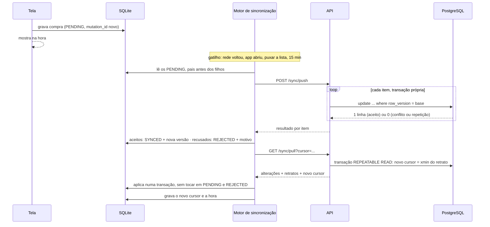

# Sincronização

Como o aparelho e o servidor trocam alterações sem perder dado, sem duplicar e sem depender de relógio. Especifica o que o [ADR-003](decisoes/adr-003-persistencia-local-e-sincronizacao.md) decidiu e o [ADR-008](decisoes/adr-008-protocolo-de-sincronizacao.md) detalhou. Rotas e formatos completos em [api.md](api.md#sincronização-comprador).

---

## Garantias

| Garantia | Como |
|---|---|
| Nada criado sem rede se perde | Todo registro nasce no SQLite com `sync_state = PENDING` e só deixa esse estado quando o servidor responde |
| Reenviar não duplica | `mutation_id` por alteração; o servidor reconhece a repetição e responde "aceito" de novo |
| Nenhuma alteração do servidor escapa do pull | Cursor por transação (`change_xid`), não por relógio |
| Edição simultânea em dois aparelhos não se sobrescreve em silêncio | Trava otimista (`row_version`); o segundo recebe conflito e escolhe |
| Exclusão chega a todos os aparelhos | Marca `deleted_at`; aparelho parado além da retenção recebe um retrato completo |
| Um registro recusado não trava os outros | Resultado por item; cada item em transação própria |

---

## Campos envolvidos

| Campo | Onde | Significado |
|---|---|---|
| `row_version` | servidor e aparelho | Versão da linha no servidor. Começa em 1 e avança a cada alteração (gatilho). No aparelho, 0 significa "nunca aceito pelo servidor" |
| `change_xid` | servidor | Transação que fez a última alteração (`pg_current_xact_id()`, gatilho) |
| `last_mutation_id` | servidor | Última alteração aplicada àquela linha |
| `mutation_id` | aparelho | Identificador (UUID v7) da alteração pendente; muda a cada nova edição local |
| `sync_state` | aparelho | `SYNCED`, `PENDING` ou `REJECTED` |
| `conflict_snapshot` | aparelho | Versão do servidor recebida num conflito, para o usuário escolher |
| `cursor` | aparelho (`sync_state`) | Até onde o aparelho já recebeu |

---

## Ciclo



**Envia antes de receber.** Assim o pull já traz o resultado das próprias alterações e não sobrescreve o que ainda nem foi enviado.

---

## Envio: `POST /sync/push`

Cada item leva a versão do servidor que o aparelho conhecia (`baseVersion`) e o identificador da alteração (`mutationId`).

```json
{
  "items": [
    { "entity": "store", "op": "upsert", "id": "0192f39e-11aa-7c3d-8e20-1f2d3c4b5a69",
      "mutationId": "0192f3a2-0000-7000-8000-000000000001", "baseVersion": 0,
      "data": { "name": "Loja A", "countryCode": "CN" } },
    { "entity": "purchase", "op": "upsert", "id": "0192f3a1-7c4e-7b2a-9d10-5b8e2c1f4a77",
      "mutationId": "0192f3a2-0000-7000-8000-000000000002", "baseVersion": 3,
      "data": { "notes": "presente de aniversário" } },
    { "entity": "offer", "op": "delete", "id": "0192f3a0-5555-7aaa-8bbb-cccccccccccc",
      "mutationId": "0192f3a2-0000-7000-8000-000000000003", "baseVersion": 2 }
  ],
  "readNotifications": [1042, 1043]
}
```

`data` leva o registro completo em `upsert` com `baseVersion = 0` (criação) e só os campos editáveis nas demais. No máximo 200 itens por envio; o motor envia em lotes.

### Decisão por item

O servidor aplica, **em transação própria por item**, a primeira linha que casar:

| # | Situação no servidor | Resultado |
|:---:|---|---|
| 1 | `baseVersion = 0` e o id não existe | Insere com `row_version = 1` → `accepted` |
| 2 | O id existe e `last_mutation_id = mutationId` | Repetição de algo já aplicado → `accepted` com a versão atual, sem alterar nada |
| 3 | O id não existe, é de outro usuário, está excluído (`deleted_at`) ou foi removido pela retenção | `rejected` · `NOT_FOUND` |
| 4 | `baseVersion = row_version` | Valida as regras, aplica, `row_version + 1` → `accepted` com a nova versão |
| 5 | `baseVersion ≠ row_version` | `rejected` · `SYNC_CONFLICT`, com o registro atual do servidor em `current` |

A linha 4 é uma única instrução, segura contra dois envios simultâneos:

```sql
update purchases
   set notes = ?, last_mutation_id = ?
 where id = ? and user_id = ? and row_version = ? and deleted_at is null;
-- 0 linhas → consultar e decidir entre as linhas 2, 3 e 5
```

Regras de negócio violadas na linha 1 ou 4 respondem `rejected` com o código da regra (`TRACKING_CODE_DUPLICATED`, `STORE_IN_USE`, `PURCHASE_CONCLUDED`, `VALIDATION_ERROR`…), no mesmo formato de erro da API.

**Ordem de aplicação:** lojas, grupos, compras, ofertas; exclusões na ordem inversa. Se o pai foi recusado, o filho que depende dele responde `DEPENDENCY_REJECTED` em vez de um erro de chave estrangeira.

**Pai excluído em outro aparelho:** a chave estrangeira não basta, porque a linha marcada com `deleted_at` ainda existe e a satisfaz. Nas linhas 1 e 4, antes de gravar, o serviço confere que cada pai referenciado (`store_id`, `product_group_id`, `purchase_id` da oferta) existe, é do usuário e **não está excluído**; se não estiver, responde `DEPENDENCY_REJECTED` com o campo do pai. Sem essa conferência, uma compra criada sem rede apontaria para uma loja já excluída, e a loja "excluída" voltaria a estar em uso (RF-12).

**Leituras de alertas** (`readNotifications`) são idempotentes: marcam `read_at` só onde ainda está nulo e ignoram ids que não são do usuário.

```json
200 OK
{ "results": [
    { "id": "0192f39e-…", "status": "accepted", "version": 1 },
    { "id": "0192f3a1-…", "status": "rejected",
      "error": { "code": "SYNC_CONFLICT", "message": "Alterada em outro aparelho." },
      "current": { "rowVersion": 4, "notes": "presente", "…": "…" } },
    { "id": "0192f3a0-…", "status": "accepted", "version": 3 }
] }
```

---

## Recebimento: `GET /sync/pull?cursor=`

### Por que o cursor não é um horário

Um cursor por `updated_at` perde alterações de duas formas:

1. **Relógio do aparelho:** se o servidor guardasse o horário enviado pelo cliente, uma edição feita offline às 9h50 e enviada às 10h05 ficaria "antes" de um pull feito às 10h00 por outro aparelho, que nunca a veria.
2. **Transação longa:** uma transação que começa às 10h00 e termina às 10h02 grava `updated_at = 10h00`. Um pull às 10h01 não a vê (ainda não terminou) e avança o cursor para 10h01. Ela é perdida para sempre.

O cursor é o **identificador de transação** do PostgreSQL:

```sql
begin isolation level repeatable read read only;
select pg_snapshot_xmin(pg_current_snapshot());   -- novo cursor
select ... from purchases where user_id = ? and change_xid >= ?;   -- cursor anterior
-- ... demais tabelas no mesmo retrato
commit;
```

`pg_snapshot_xmin` é a transação mais antiga ainda em andamento no momento do retrato. Tudo o que o retrato não enxerga (em andamento ou iniciado depois) tem `change_xid` maior ou igual a ele e entra no próximo pull. O preço é reenviar algumas linhas já recebidas, o que é inofensivo porque aplicar a mesma versão duas vezes não muda nada (verificação 13 de [`schema-checks.sql`](sql/schema-checks.sql)).

O cursor chega ao app como texto opaco (base64 de `{"xid":"782","issuedAt":"2026-10-12T17:30:05Z"}`). O app só guarda e devolve; nunca interpreta.

### O que vem na resposta

| Bloco | Forma | Motivo |
|---|---|---|
| `stores`, `productGroups`, `offers`, `purchases` | **Incremental** desde o cursor, incluindo exclusões (`deletedAt`) | Acervo do usuário, pode ser grande |
| `timelines` | **Linha do tempo inteira** de cada compra cuja linha ou algum evento mudou | Trocar o código de rastreio apaga eventos; substituir a lista inteira evita propagar exclusões uma a uma |
| `purchaseStates` | **Retrato** de toda compra não excluída, inclusive as concluídas | Atraso, janela e taxa vencida mudam com a data, sem nenhuma linha mudar. Incremental não os pegaria. As concluídas entram porque o retrato substitui a tabela local: fora dele, uma compra entregue perderia a situação no aparelho, que não calcula a RN01, e sairia de "Entregues recentemente" (T03), do painel (T06) e da trava da RN09 |
| `notifications` | **Retrato** do conjunto retido (não lidas + 50 lidas) | A RN11 apaga fisicamente; retrato dispensa propagar exclusões |
| `exchangeRates`, `taxParameters` | Incremental | Crescem devagar |
| `currencies` | Retrato | Três linhas |
| `cursor` | Novo cursor | |
| `reset` | `true` quando o retrato é completo | Ver abaixo |

Cada bloco é uma consulta por tabela filtrada pelo usuário; nenhuma consulta por registro.

### Primeiro acesso e retrato completo

- **Sem cursor** (primeiro login no aparelho): tudo o que não está excluído, com `reset: true`.
- **Cursor mais velho que 30 dias** (a retenção das marcas de exclusão): o servidor não sabe mais o que foi apagado nesse intervalo. Responde o retrato completo com `reset: true`, em vez de erro.

Com `reset: true` o app substitui tudo o que está `SYNCED` e mantém `PENDING` e `REJECTED`. Assim um aparelho que ficou 40 dias na gaveta perde as lojas apagadas em outro aparelho, mas não perde o que cadastrou offline.

---

## Aplicação no aparelho

Numa única transação SQLite, pais antes dos filhos:

1. Registro recebido que localmente está **`PENDING` ou `REJECTED`**: não é tocado. A alteração local ainda será enviada ou está esperando o usuário decidir.
2. Registro `SYNCED` ou inexistente: grava a versão do servidor.
3. `deletedAt` preenchido: remove a linha local (e, em cascata, eventos e estado). **Exceção:** se algum filho local `PENDING` ou `REJECTED` ainda aponta para ela (uma compra criada sem rede na loja que outro aparelho excluiu), a linha não é removida: recebe `deleted_at`, some das listas e continua existindo só para satisfazer a chave estrangeira. Removê-la violaria a FK do SQLite, desfaria o pull inteiro e o cursor nunca mais avançaria.
4. Retratos (`purchaseStates`, `notifications`, `currencies`): substituem a tabela. Leituras de alerta ainda não enviadas (`read_pending`) são preservadas. Compra local ainda sem situação no retrato (criada sem rede, não aceita) aparece como "Aguardando postagem" até o próximo pull.
5. Remove as linhas `SYNCED` com `deleted_at` que já não têm filhos locais (as mantidas no passo 3 cujo filho o usuário já resolveu).
6. Grava o novo cursor e a hora da sincronização.

Se qualquer passo falhar, a transação desfaz tudo e o cursor não avança: o próximo pull repete o mesmo intervalo.

### Várias edições offline, um envio

A fila de envio é a própria linha (`sync_state = PENDING`). Editar três vezes a mesma compra sem rede gera **um** item no próximo envio, com o estado final e o último `mutation_id`. Não existe log de operações para reconciliar.

### Conflito

Quando o servidor responde `SYNC_CONFLICT`, o app marca `REJECTED`, guarda `current` em `conflict_snapshot` e mostra ao lado do registro: "Esta compra foi alterada em outro aparelho." O usuário escolhe:

| Escolha | O que o app faz |
|---|---|
| Manter a minha | `baseVersion` passa a ser a versão de `current`, novo `mutation_id`, volta a `PENDING` |
| Usar a do outro aparelho | Grava `current`, `SYNCED`, limpa `conflict_snapshot` |

"Última escrita vence" automática foi descartada: o próprio usuário, em dois aparelhos, perderia uma das edições sem saber ([ADR-008](decisoes/adr-008-protocolo-de-sincronizacao.md)). Conflitos são raros (um usuário, poucos aparelhos), então pedir a escolha custa pouco.

**Rastreio e usuário não conflitam:** a importação grava em `tracking_events` e em `purchases.tracking_checked_at`, que o usuário não edita. O gatilho de versão de `purchases` só dispara nas colunas do usuário (`before update of ...`), então a consulta à fonte a cada 20 minutos não avança `row_version` e não transforma a próxima edição do usuário em conflito falso (verificação 14 de [`schema-checks.sql`](sql/schema-checks.sql)). Os eventos novos chegam ao aparelho pelo `change_xid` da própria tabela de eventos.

---

## Quando sincroniza

| Gatilho | Observação |
|---|---|
| App aberto | |
| Rede recuperada | Evento do sistema |
| Puxar a lista | Gesto do usuário |
| A cada 15 min com o app aberto | |
| Depois de salvar algo | Com espera de 2 s, para agrupar edições seguidas |

Falha de rede ou 5xx: nova tentativa com espera crescente (30 s, 1 min, 2 min… até 15 min). Nada é apagado. Tempo limite de 10 s por chamada à API. Só um ciclo de sincronização roda por vez no aparelho.

---

## Cenários

| Cenário | Resultado esperado | Caso de teste |
|---|---|:---:|
| Cadastrar compra em modo avião e reconectar | Aparece na hora; depois existe na API com o mesmo id | CT-41 |
| Envio chega ao servidor, resposta se perde, app reenvia | `accepted` nas duas vezes; uma única linha | CT-48 |
| Mesma compra editada em dois aparelhos | O segundo envio recebe `SYNC_CONFLICT` com a versão do primeiro | CT-49 |
| Loja apagada no aparelho A; aparelho B sincroniza | Some de B | CT-50 |
| Aparelho parado 40 dias com uma compra nova pendente | Recebe retrato completo; a compra nova é enviada e mantida | CT-51 |
| Compra excluída em A enquanto B tinha edição pendente | B recebe `NOT_FOUND` e a edição é descartada com aviso | CT-52 |
| Loja excluída em A enquanto B tinha compra nova nela, pendente | A compra de B volta `DEPENDENCY_REJECTED` no campo da loja; o pull conclui, a loja some da lista de B e a compra pede outra loja | CT-59 |
| Compra entregue; B sincroniza | A situação Entregue continua no aparelho e a compra aparece em "Entregues recentemente" | CT-57 |
| API fora do ar ao puxar a lista | Mensagem de falha; nenhum dado local apagado | CT-42 |
