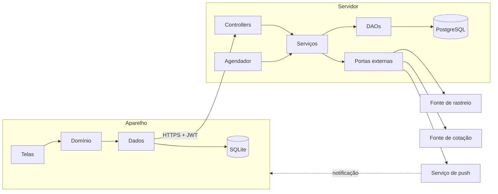
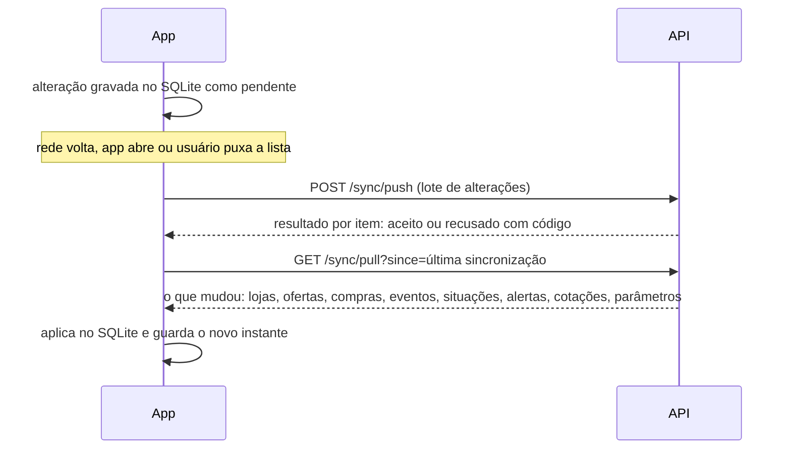

# Arquitetura

Como o sistema é dividido, onde cada regra roda e como os dados circulam entre o aparelho e o servidor.

---

## Resumo

Cliente-servidor com **o app funcionando primeiro no aparelho**. O app lê e grava no próprio SQLite e sincroniza com a API quando há rede. A API guarda a versão oficial dos dados, conversa com os serviços externos e dispara os alertas. As duas pontas são organizadas em camadas, com dependência só para dentro.



| Parte | Responsabilidade |
|---|---|
| **App** | Telas, cópia local do acervo, validação de formulário, simulação de custo, fila de sincronização, lembretes locais |
| **API** | Dados oficiais, isolamento entre usuários, importação de rastreio, cotação, situação e alertas, envio de push, administração |
| **Serviços externos** | Rastreio, cotação e entrega de notificações |

**Princípio central:** a tela nunca espera a rede. Toda leitura e escrita acontecem primeiro no aparelho; a rede serve para sincronizar.

| Modelagem | Documento |
|---|---|
| Classes, objetos de valor, regras e estados | [Modelo de domínio](modelo-de-dominio.md) |
| Tabelas, garantias no banco e base local | [Modelo de dados](modelo-de-dados.md) |
| Troca entre aparelho e servidor | [Sincronização](sincronizacao.md) |
| Rotas, formatos e erros | [API](api.md) |

---

## Tecnologias

| Parte | Tecnologia | Decisão |
|---|---|:---:|
| App | React Native, Expo, TypeScript, Expo Router, React Hook Form, Zod | [ADR-001](decisoes/adr-001-plataforma-movel.md) |
| Banco local | SQLite (`expo-sqlite`), SQL escrito à mão e parametrizado | [ADR-003](decisoes/adr-003-persistencia-local-e-sincronizacao.md), [ADR-008](decisoes/adr-008-protocolo-de-sincronizacao.md) |
| Sessão no aparelho | `expo-secure-store` | [ADR-001](decisoes/adr-001-plataforma-movel.md), [ADR-009](decisoes/adr-009-sessao-e-revogacao.md) |
| Notificações | `expo-notifications` e serviço de push da Expo | [ADR-007](decisoes/adr-007-notificacoes.md) |
| API | Java 21, Spring Boot 4, Spring Security com JWT | [ADR-002](decisoes/adr-002-retaguarda.md) |
| Persistência remota | JDBC com DAOs (`JdbcTemplate`), transações com `@Transactional` | [ADR-002](decisoes/adr-002-retaguarda.md) |
| Banco remoto | PostgreSQL 18, migrations com Flyway | [ADR-002](decisoes/adr-002-retaguarda.md) |
| Integrações | Portas com adaptadores trocáveis para rastreio e cotação | [ADR-005](decisoes/adr-005-fonte-de-rastreio.md), [ADR-006](decisoes/adr-006-fonte-de-cotacao.md) |
| Testes | Jest no app; JUnit 5 e Testcontainers na API | [plano de testes](../05-qualidade/plano-de-testes.md) |
| Build do APK | EAS Build | [ADR-001](decisoes/adr-001-plataforma-movel.md) |

---

## App

| Camada | Contém | Não pode |
|---|---|---|
| **Telas** | Componentes, rotas, estados de tela (carregando, vazio, erro, conteúdo) | Executar SQL ou chamar a API |
| **Domínio** | Tipos, validações, cálculo de custo (RN07, RN10), casos de uso | Depender de React, SQLite ou HTTP |
| **Dados** | Repositórios SQLite, cliente HTTP, motor de sincronização, lembretes | Conhecer telas |

O domínio declara interfaces e a camada de dados as implementa, o que permite testar as regras sem aparelho, banco ou rede.

```
app/                      rotas do Expo Router
  (auth)/                 entrar, criar conta
  (comprador)/(abas)/     compras, ofertas, painel, alertas
  (comprador)/            detalhe da compra, oferta, comparação, perfil, lojas
  (admin)/(abas)/         contas, câmbio, integração
src/
  features/<modulo>/      ui/ · domain/ · data/     (acesso, compras, ofertas, rastreio, alertas, admin)
  shared/                 db/ · api/ · sync/ · ui/
```

O app (`app/`) é responsabilidade do frontend e a API (`api/`), do backend; os testes de cada lado ficam junto do código que testam ([equipe](../04-projeto/equipe.md)).

---

## API

| Camada | Contém | Regra |
|---|---|---|
| **Controllers** | Rotas REST, DTOs, validação de formato, usuário da sessão | Chama serviços; não conhece SQL |
| **Serviços** | Casos de uso, regras de negócio, fronteira de transação | Chama DAOs e portas por interface |
| **DAOs** | SQL parametrizado via `JdbcTemplate` | Só conhece o banco |
| **Portas** | `TrackingSource`, `ExchangeRateSource`, `PushSender` e adaptadores | Isolam os serviços externos |

```
br.com.importaai
  acesso/          autenticação, sessão, usuários
  compras/         compras e lojas
  ofertas/         ofertas
  rastreio/        agendador, importação de eventos, situação, execuções
  alertas/         avaliação de alertas, aparelhos, envio de push
  referencia/      cotações e parâmetros fiscais
  sincronizacao/   envio e recebimento de alterações
  admin/           contas, câmbio, parâmetros, saúde da integração
  compartilhado/   configuração, segurança, tratamento de erros
```

Portas existem **só onde a troca é real**: a fonte de rastreio pode mudar, a cotação tem duas fontes e o push depende de terceiros. O banco não fica atrás de porta, porque trocá-lo não está em questão.

O contrato REST está em [api.md](api.md).

---

## Onde cada regra roda

Cada regra tem **um único dono**, para nunca existirem duas versões que divergem ([ADR-004](decisoes/adr-004-dono-de-cada-regra.md)).

| Regra | Dono | Motivo | O que o outro lado faz |
|---|:---:|---|---|
| Validação de formulário | App | Resposta imediata, junto ao campo | API revalida o formato |
| RN07 conversão · RN10 simulação | **App** | Precisam funcionar sem rede | API fornece cotações e parâmetros |
| RN01 situação | **API** | Depende dos eventos, que só a API recebe | App guarda o resultado para exibir sem rede e envia a confirmação manual de recebimento |
| RN02, RN03, RN05, RN06 alertas | **API** | Precisam disparar com o app fechado | App exibe e marca como lido |
| RN04 taxa | **API e app** | API detecta a taxa; app agenda os lembretes locais | · |
| RN08 isolamento | **API** | O aparelho não decide acesso | App carrega só a navegação do perfil |
| RN09 compra concluída | **API** | Protege contra envio adulterado | App trava os campos e mostra o motivo |
| RN11 retenção | **API** | Rotina diária de limpeza | · |

---

## Sincronização



| Aspecto | Decisão |
|---|---|
| Quando | Ao abrir o app, ao recuperar a rede, ao puxar a lista, depois de salvar e a cada 15 min com o app aberto |
| Ordem | Envia antes de receber |
| Identidade | Registros criados no aparelho têm UUID v7 |
| Reenvio | Cada alteração leva `mutationId`; repetir não duplica |
| Cursor | Identificador de transação do PostgreSQL, não horário: nenhuma alteração escapa |
| Conflito | Trava otimista por `row_version`; edição simultânea em dois aparelhos volta como conflito e o usuário escolhe |
| Exclusão | Marca `deleted_at`; aparelho parado há mais de 30 dias recebe retrato completo |
| Recusa | Item recusado fica marcado no aparelho, com a mensagem ao lado do registro |
| Falha de rede | Nada é apagado; tenta de novo com espera crescente |
| Tempo limite | 10 s para a API; 8 s para serviços externos |

Protocolo completo em [sincronização](sincronizacao.md); decisões no [ADR-003](decisoes/adr-003-persistencia-local-e-sincronizacao.md) e no [ADR-008](decisoes/adr-008-protocolo-de-sincronizacao.md).

---

## Integrações e rotinas

| Rotina na API | Intervalo | O que faz |
|---|:---:|---|
| Rastreio | 20 min | Consulta compras em andamento, importa eventos novos, recalcula situação, avalia alertas (grava na caixa de saída do push) e registra a execução |
| Cotação | 1 h | Busca a cotação do dia de USD, CNY e EUR e registra a execução |
| Envio de push | 1 min | Envia os alertas pendentes da caixa de saída, com até 5 tentativas |
| Alertas por data | diária | Reavalia atraso e janela, que mudam com o calendário |
| Limpeza | diária | Aplica RN11; remove exclusões marcadas há mais de 30 dias, sessões encerradas e execuções com mais de 90 dias ([retenção](modelo-de-dados.md#retenção)) |

| Serviço externo | Se falhar |
|---|---|
| Rastreio | Execução registrada como parcial ou falha; a próxima rodada tenta de novo; o administrador vê em T15. Se a própria API cair no meio da rodada, a execução órfã é encerrada como falha na rodada seguinte ([domínio](modelo-de-dominio.md#execução-de-integração)) |
| Cotação | Usa a última disponível e sinaliza "desatualizada" após 24 h |
| Push | O alerta continua gravado e aparece na próxima sincronização; a caixa de saída tenta de novo e marca `FAILED` após 5 tentativas |

---

## Notificações

| Tipo | Origem | Exemplos | Funciona sem rede? |
|---|---|---|:---:|
| Push remoto | API | Taxa detectada, atraso, pacote parado, janela de reclamação | Chega quando houver rede |
| Lembrete local | App | Taxa vence em 5 dias, em 2 dias, hoje | **Sim** |

Tocar na notificação abre o detalhe da compra. Detalhes em [ADR-007](decisoes/adr-007-notificacoes.md).

---

## Segurança

| Tema | Decisão |
|---|---|
| Transporte | Somente HTTPS |
| Senha | BCrypt; nunca aparece em log |
| Sessão | Token de acesso de 15 min; renovação de 7 dias, opaca, rotativa e revogável, guardada no armazenamento seguro do aparelho ([ADR-009](decisoes/adr-009-sessao-e-revogacao.md)) |
| Tentativas | 5 falhas bloqueiam por 15 min; a mensagem não diz se o erro foi no e-mail ou na senha |
| Isolamento | O `user_id` vem sempre do token, nunca do corpo da requisição; FKs compostas impedem, no banco, referência ao acervo de outro usuário |
| SQL | Sempre parametrizado |
| Segredos | Variáveis de ambiente; `.env.example` versionado, `.env` nunca |
| Exclusão de conta | Revoga as sessões e apaga o usuário e, em cascata, tudo o que é dele, inclusive os aparelhos |
| Bloqueio | Revoga todas as sessões e remove os aparelhos da conta na mesma transação; vale em até 15 min, e nenhum push sai depois dele |
| Saída | Revoga a sessão, remove o aparelho (`/auth/logout`), cancela os lembretes locais e apaga a base. Sem rede, a saída local acontece na hora e o pedido fica no armazenamento seguro até a rede voltar; sem isso, o aparelho continuaria recebendo push de uma conta que já saiu |

---

## Ambientes e repositório

```
projeto-integrador/
  app/            Expo
  api/            Spring Boot
  docs/           documentação
  compose.yml     PostgreSQL de desenvolvimento
  .env.example    variáveis necessárias, sem valores
```

| Ambiente | App | API | Banco | Rastreio |
|---|---|---|---|---|
| Desenvolvimento | Build de desenvolvimento | Local | PostgreSQL no Docker | Simulado |
| Demonstração | APK em aparelho físico | Hospedada com HTTPS | PostgreSQL gerenciado | Real, se viável; simulado como plano B |
