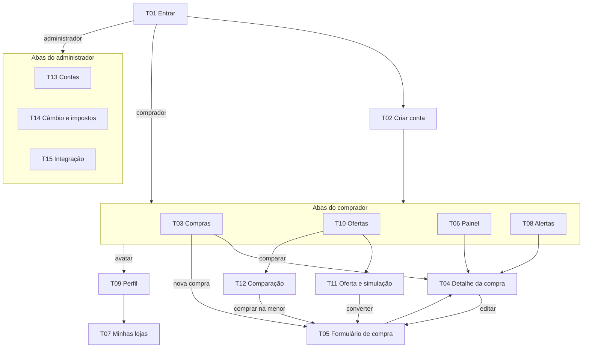

# Telas e navegação

As 15 telas do app, como se conectam e o que cada uma mostra em cada estado. O desenho está no [protótipo](prototipo.md).

---

## Mapa

**Duas árvores de navegação:** o perfil define qual é carregada, para que nenhum elemento de administração apareça por falha de verificação.

---

## Padrões

| Padrão | Uso |
|---|---|
| Abas | Comprador: Compras, Ofertas, Painel, Alertas. Administrador: Contas, Câmbio, Integração |
| Tela de aba | Cabeçalho com título, subtítulo, sino de alertas e avatar |
| Tela empilhada | Barra com voltar; ações raras ou destrutivas no menu (⋮) |
| Formulário | Ação principal num rodapé fixo, sempre visível |
| Botão flutuante | "Nova compra" (T03) e "Nova oferta" (T10), acima das abas |

### Estados de toda tela

| Estado | Comportamento |
|---|---|
| Carregando | Esqueleto com a forma do conteúdo; o layout não pula |
| Vazio | Sempre com a causa e uma ação para sair dele |
| Sem conexão | Banner no conteúdo com a hora da última sincronização e "Tentar de novo"; os dados locais continuam visíveis |
| Erro de validação | Junto ao campo, com ícone e razão |
| Ação destrutiva | Confirmação que nomeia o item afetado |

---

## Comprador

### T01 · Entrar · RF-02

E-mail, senha com botão de mostrar, "Entrar"; "Criar conta" como ação secundária. Aviso de que 5 tentativas erradas bloqueiam por 15 minutos.
**Erro:** credencial inválida sem dizer se o erro foi no e-mail ou na senha; conta bloqueada mostra o tempo restante.

### T02 · Criar conta · RF-01

Nome, e-mail, senha com medidor de força e requisitos marcados enquanto digita, confirmação. Aviso de termos e privacidade.
**Erro:** e-mail já cadastrado, junto ao campo, oferecendo entrar com ele.

### T03 · Compras · RF-11, RF-13, RF-14, RF-15, RF-20

Busca por produto, loja ou código; filtros; lista **agrupada por prioridade**: "Precisa de atenção", "A caminho", "Entregues recentemente". Cada card mostra produto, valor em reais, loja, código, situação, prazo e sinalizações.
**Vazio:** sem compras, convida a cadastrar ou simular; com filtro sem resultado, oferece limpar o filtro. São mensagens diferentes porque pedem ações diferentes.

### T04 · Detalhe da compra · RF-09, RF-11, RF-13, RF-16

Situação, produto, loja e código com botão de copiar. Quando há taxa pendente, um **card de ação** no topo com prazo, valor, consequência e "Registrar pagamento". Valores (na origem, em reais pela cotação da compra, taxa, total), prazo e janela de reclamação, linha do tempo com a etapa atual destacada. Editar, **confirmar recebimento**, arquivar e excluir no menu. Registro recusado na sincronização mostra o motivo no topo; em conflito, oferece "Manter a minha" ou "Usar a do outro aparelho".
**Vazio:** sem eventos, "aguardando primeira movimentação".

### T05 · Formulário de compra · RF-07, RF-08, RF-10, RF-16

Blocos: Produto (descrição, loja), Rastreio (código), Valores (moeda, valor, frete, conversão aproximada ao vivo), Prazos (data da compra, prazo prometido). Taxa como opção recolhida. Vindo de uma oferta, chega preenchido. "Salvar compra" no rodapé fixo.
**Erro:** código duplicado oferece abrir a compra existente. Compra concluída mostra os campos protegidos travados, com o motivo.

### T06 · Painel · RF-18, RF-19

Filtro de período. Valor em trânsito em destaque; gasto e impostos do período; gasto por mês; compras por situação; pontualidade por loja com uma conclusão ("com preço parecido, a Loja A é a escolha mais segura").
**Vazio:** sem compras, convite ao cadastro, nunca indicadores zerados.

### T07 · Minhas lojas · RF-12

Lista com país, uso (compras e ofertas) e pontualidade. "Nova" na barra.
**Erro:** loja em uso não pode ser excluída; o próprio item explica quantas compras e ofertas impedem e o que fazer.

### T08 · Alertas · RF-15, RF-16, RF-17

Alertas por dia, com ícone por motivo, o que aconteceu, a consequência e uma **ação direta** ("Registrar pagamento", "Ver rastreio"). Não lido marcado por negrito e ponto, não só por cor. "Marcar todos como lidos".
**Vazio:** "Nenhum alerta", apresentado como algo bom.

### T09 · Perfil · RF-03

Conta, estado da sincronização com a hora e "sincronizar agora", grupos Conta, Preferências e Privacidade. "Excluir minha conta" isolado e explicando o que é apagado; "Encerrar sessão" avisa se há alteração não sincronizada; ao confirmar, cancela os lembretes de taxa agendados e o aparelho deixa de receber avisos da conta, mesmo sem rede no momento.

### T10 · Ofertas · RF-04, RF-20

Ofertas **agrupadas por produto**, cada grupo com "Comparar". Cada oferta: loja, preço na origem, custo final estimado e o selo "Menor custo" ou a diferença para a menor. Grupo com uma oferta convida a adicionar outra loja.
**Vazio:** explica o que a simulação responde e oferece a primeira.

### T11 · Oferta e simulação · RF-04, RF-05, RF-07

Custo final estimado em destaque, com o selo "Estimativa". "Para onde vai o dinheiro": barra com produto e frete, imposto e ICMS, e a conclusão sobre o peso dos impostos. Dados da oferta editáveis, com recálculo imediato. Rodapé com "Salvar" e "Converter em compra".
**Erro:** cotação com mais de 24 horas sinalizada junto ao total.

### T12 · Comparação · RF-06

**Veredito primeiro:** qual loja sai mais barata, quanto e por quê. Tabela lado a lado e "de onde vem a diferença", parcela por parcela. Rodapé com "Comprar na Loja A".

## Administrador

### T13 · Contas · RF-21

Resumo (total, ativas, bloqueadas), busca e filtros. Cada conta mostra status em texto: ativa, bloqueio temporário (com hora de liberação) ou bloqueada (com autor e data). Bloquear e reativar no menu, com confirmação. Nenhuma informação de compra (RN08).

### T14 · Câmbio e impostos · RF-22

Cotações do dia com origem e idade; manuais mostram autor e o valor automático substituído. Parâmetros fiscais vigentes escritos como regra, com um exemplo aplicado e as versões anteriores.
**Validação:** cotação fora de ±50% da última automática pede confirmação; vigência não pode ser retroativa.

### T15 · Integração · RF-23

Estado geral em uma frase, últimas execuções, indicadores com referência do que é normal e últimas falhas com causa.
**Erro:** "indicador indisponível" é diferente de "nenhuma falha", para uma falha de apuração nunca parecer sistema saudável.
