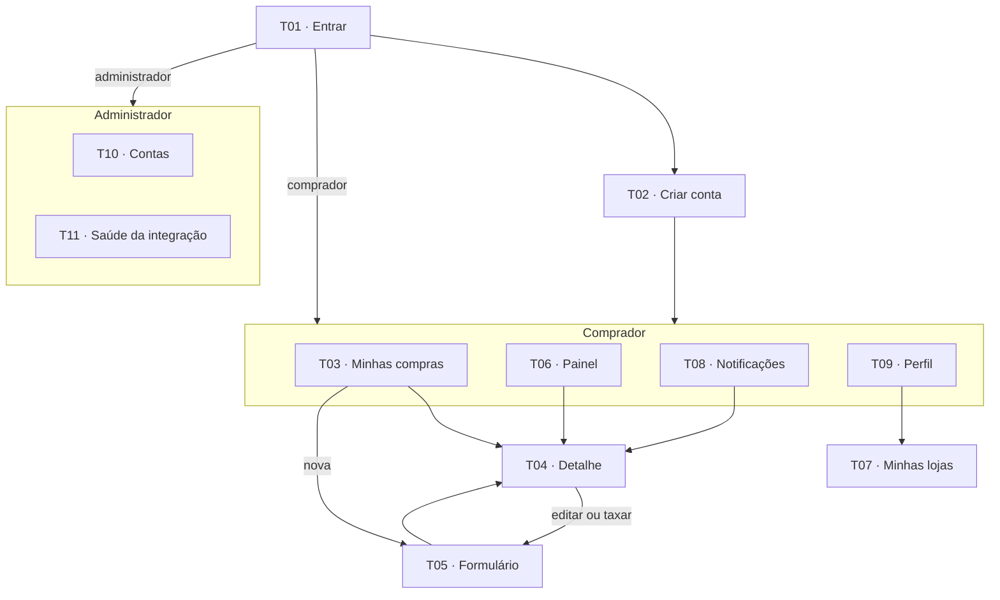

# Navegação e telas

`A9` · **rascunho** · 11/09/2026 · alimenta A10, A11, A15

> Onze telas, contra o mínimo de seis de R1. O excedente não é inflação: T10 e T11 existem porque o perfil administrativo tem atribuição real (RN08), e T07 porque Loja é entidade com CRUD (R3).

---

## 1. Mapa

| Padrão | Definição |
|:---:|---|
| Comprador | Quatro abas fixas na base. Quatro é o limite em que o alvo de toque continua confortável (ver A11) |
| Administrador | Dois destinos, mesma estrutura |
| Detalhe e formulário | Empilhados sobre a aba de origem, com retorno ao ponto anterior |

> [!IMPORTANT]
> **Duas árvores, não uma com trechos ocultos.** O perfil determina a navegação carregada. Assim nenhum elemento administrativo aparece por falha de verificação.

---

## 2. Telas

Cada tela declara os quatro estados de R10. Tela sem estado vazio declarado é defeito de especificação, não de implementação.

### T01 · Entrar `RF-02`

**Conteúdo.** E-mail, senha, entrar, ir para criar conta.

**Carregando.** Botão em espera, campos bloqueados.

**Erro.** Credencial inválida **sem distinguir e-mail de senha**. Conta bloqueada informa o tempo restante.

**Validação.** Formato de e-mail, senha não vazia.

> [!NOTE]
> A mensagem não distingue e-mail inexistente de senha errada, para não confirmar a existência de uma conta a quem não a possui. Mesma postura de RN08.

### T02 · Criar conta `RF-01`

**Conteúdo.** Nome, e-mail, senha, confirmação.

**Erro.** E-mail já cadastrado, indicado junto ao campo.

**Validação.** Senha com 8+ caracteres, confirmação idêntica, e-mail único.

### T03 · Minhas compras `RF-08 · RF-11 · RF-12 · RF-16`

**Conteúdo.** Compras ativas com produto, loja, estado, prazo e sinalização de atraso, estagnação ou taxa. Busca, filtro por estado, ordenação. Acesso ao histórico.

**Carregando.** Esqueleto de três linhas, sem deslocar o layout ao resolver.

**Vazio A.** Primeira compra: explicação e ação de cadastro.

**Vazio B.** Filtro sem resultado: mensagem distinta, com ação de limpar filtro.

**Erro.** Falha de sincronização **não esvazia a lista**. Mostra o acervo local com a data da última atualização.

**Offline.** Faixa permanente com a data da última sincronização.

> [!IMPORTANT]
> [!WARNING]
> Os dois vazios são distintos de propósito. "Você ainda não cadastrou compras" e "nenhuma compra corresponde ao filtro" exigem ações opostas, e unificá-los é a falha mais comum em listagem filtrada.

### T04 · Detalhe da compra `RF-05 · RF-06 · RF-08 · RF-13`

**Conteúdo.** Dados da compra, valor na origem e em BRL, estado, sinalizações, linha do tempo decrescente, bloco de taxa, anotações. Editar, arquivar, excluir.

**Carregando.** Cabeçalho com dado local, linha do tempo em esqueleto.

**Vazio.** Sem eventos: "aguardando primeira movimentação", com a data do cadastro.

**Erro.** Falha ao atualizar mantém os eventos já obtidos.

**Confirmação.** Excluir exige confirmação (RNF-03).

### T05 · Formulário de compra `RF-04 · RF-05 · RF-07 · RF-13`

**Conteúdo.** Produto, código, loja (com criação no próprio formulário), datas, valor, moeda, taxa, anotações.

**Carregando.** Em edição, campos vêm do acervo local, sem espera.

**Erro.** Validação por campo, com a razão ao lado. Código duplicado oferece abrir a compra existente.

**Validação.** Data não futura, prazo >= compra, valor > 0, código único por usuário.

**Restrição.** Em compra concluída, os campos de RN09 ficam somente leitura **com a razão visível**, não simplesmente ocultos.

### T06 · Painel `RF-14 · RF-15`

**Conteúdo.** Compras por estado, total em trânsito, total entregue no período, total de taxas, desvio de prazo por loja.

**Vazio.** Sem compras: convite ao cadastro, **sem exibir indicadores zerados**.

**Erro.** Indicador sem cotação é exibido na moeda de origem com aviso, em vez de omitido.

> [!NOTE]
> [!NOTE]
> Indicador zerado para quem nunca cadastrou nada comunica erro do sistema, não ausência de dado. Por isso vazio e zerado são estados distintos.

### T07 · Minhas lojas `RF-09`

**Conteúdo.** Lojas com a quantidade de compras associadas. Cadastrar, alterar, excluir.

**Vazio.** Explicação e ação de cadastro.

**Erro.** Excluir loja com compras é recusado, informando **quantas** compras impedem.

### T08 · Notificações `RF-12 · RF-13 · RF-17`

**Conteúdo.** Alertas em ordem decrescente, com motivo, compra e estado de leitura. Toque abre a compra.

**Vazio.** "Nenhum alerta", apresentado como estado positivo.

**Erro.** Lista local permanece disponível sem conexão.

### T09 · Perfil `RF-03`

**Conteúdo.** Dados da conta, acesso a T07, preferências de notificação, encerrar sessão.

**Confirmação.** Encerrar sessão adverte sobre perda do acervo local, se houver alteração pendente.

### T10 · Contas `RF-18` · administrador

**Conteúdo.** Contas com nome, e-mail, criação, estado e último acesso. Busca por e-mail. Bloquear e reativar.

**Restrição.** Nenhuma coluna, ação ou rota expõe conteúdo de compra (RN08).

**Confirmação.** Bloqueio exige confirmação e registra o responsável.

### T11 · Saúde da integração `RF-19` · administrador

**Conteúdo.** Última sincronização bem-sucedida, taxa de falha em 24h, compras sem atualização há 15+ dias, últimas falhas.

**Vazio.** Sem falhas: estado positivo explícito.

**Erro.** Indisponibilidade do indicador é **distinguida** de ausência de falhas.

> [!NOTE]
> [!WARNING]
> Sem essa distinção, falha de apuração seria lida como sistema saudável, o pior resultado possível numa tela de monitoramento.

---

## 3. Estados transversais

| Estado | Tratamento |
|:---:|---|
| Carregando | Esqueleto com a forma do conteúdo final, nunca indicador que desloca o layout |
| Vazio | Sempre com causa e ação de saída |
| Erro de rede | Nunca descarta acervo local. Sempre com data da última sincronização e ação de repetir |
| Erro de validação | Junto ao campo, com a razão. Nunca em aviso global |
| Ação destrutiva | Confirmação nomeando o item afetado (RNF-03) |
| Sem conectividade | Faixa persistente, não mensagem passageira |

---

O protótipo navegável (**A10**) materializa estas telas com o cenário de A2 percorrível de ponta a ponta. Decisões de usabilidade e contraste em **A11**.

---

[Índice](../README.md)
